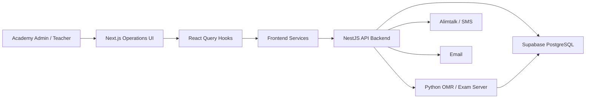

# 231EDU System Architecture

## Summary
231EDU는 Next.js frontend, NestJS API backend, Python OMR/exam server, Supabase PostgreSQL을 분리한 학원 운영 시스템입니다. 프론트엔드는 운영자 화면과 서버 상태 흐름을 담당하고, NestJS API 서버는 학생/수업/시간표/리포트/알림톡 같은 운영 도메인 API를 처리합니다. OMR 채점과 이미지 분석은 별도 Python 서버로 분리해 시험 처리 책임을 독립시켰습니다.

## Scope
- Implementation scope: Frontend + Backend + DB
- Frontend: Next.js App Router
- Backend type: NestJS API server
- OMR/Exam server: Python image processing server
- Database: Supabase PostgreSQL
- Deployment: 확인 필요

## Architecture Diagram

## Frontend
- Framework: Next.js, React, TypeScript
- UI Scope: 로그인/회원가입/초대 검증, 학생 관리, 반 관리, 반 편성, 강의실 시간표, 통합 시간표, 강사 시간표, 중등 기록, OMR 템플릿/채점, 주간 리포트
- State/Data: TanStack Query로 학생/수업/시간표/리포트 서버 상태 관리
- API Boundary: `src/services/client`, `src/queries` 계층에서 NestJS API 서버와 OMR 서버 호출
- Architecture Point: 표, 그리드, 일정 캔버스 중심의 운영자 화면 구성

## Backend/API
- Type: NestJS API server
- Main APIs: 인증/초대, 학생, 반, 과목, 강사, 반 편성, 강의실 시간표, 통합 시간표, 예외 일정, 시험 기간, 주간 리포트, 알림톡 발송
- Responsibilities: 운영 데이터 조회/변경, 리포트 생성, 외부 발송 API 호출, 발송 로그 저장, Supabase query orchestration
- Notes: 프론트엔드와 분리된 NestJS API 서버가 백엔드 책임을 담당

## OMR/Exam Server
- Type: Python image processing server
- Main APIs: OMR 이미지 업로드, 템플릿 좌표 처리, 마킹 판정, 채점 결과 생성
- Responsibilities: 시험지 이미지 분석과 채점 로직을 운영 API와 분리
- Design Point: 템플릿 좌표와 밝기/차이 임계값을 이용해 마킹 여부를 판정

## Database
- Database: Supabase PostgreSQL
- Main Data: students, classes, class_students, student_compositions, class_composition, schedules, OMR templates, weekly_reports, weekly_report_logs, exam periods
- Design Point: 학생 등록 정보와 반 편성 정보를 분리하고 `student_compositions`로 학생-반편성 관계를 명시
- Migration: 인증, 학생 등록, 반 편성, OMR 템플릿, 주간 리포트, 시험 기간 관련 SQL migration

## Storage & External Services
- OMR image processing: Python OMR/exam server에서 템플릿 좌표 기반 답안 인식
- Alimtalk/SMS: 주간 리포트 발송
- Email: 인증/안내 메일
- xlsx: 엑셀 처리

## Deployment
- 실제 배포 플랫폼과 운영 도메인은 확인 필요
- 포트폴리오 표기: `Next.js frontend + NestJS API backend + Python OMR server + Supabase PostgreSQL`

## Key Flows
- Schedule: 시간표 화면 -> React Query hook -> frontend service -> NestJS API -> Supabase schedule data
- OMR: 이미지 업로드 -> OMR/exam server -> 템플릿 좌표/밝기 판정 -> 결과 저장/표시
- Weekly Report: 리포트 생성 요청 -> NestJS API -> DB row 저장 -> 알림톡 발송 -> 발송 로그 저장

## Portfolio Notes
- 강조할 점: 학원 운영 데이터, OMR, 주간 리포트 알림톡을 하나로 묶되 서비스 책임을 frontend/backend/OMR server로 분리한 운영 자동화 구조
- 구현 범위 문구: `Frontend + Backend + DB`
- 비공개 처리: 학생 개인정보, 학원 내부 운영 데이터, 알림톡 템플릿/발송 키, Supabase 정보
