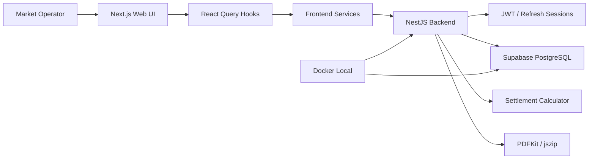

# FLEA MARKET System Architecture

## Summary
FLEA MARKET은 Next.js frontend, NestJS backend, Supabase/PostgreSQL DB가 분리된 정산 운영 시스템입니다. 기존 엑셀 정산을 receipt, payment split, sale line, participant setting, settlement snapshot 도메인으로 재구성했습니다. Docker/Supabase local 환경에서 web/API/DB 검증 흐름을 갖춘 프로젝트입니다.

## Scope
- Implementation scope: Frontend + Backend + DB
- Backend type: NestJS
- Database: Supabase PostgreSQL
- Deployment: 로컬 Docker/Supabase 확인, 공개 배포 확인 필요

## Architecture Diagram

## Frontend
- Framework: Next.js, React, TypeScript
- UI Scope: 로그인, 마켓 목록/상세, 관리 대시보드, 참가자/상품 관리, 현장 판매 입력, 영수증 목록/상세/수정, 정산 미리보기, 정산 회차 이력, 설정
- State/Data: TanStack Query로 auth, markets, participants, products, receipts, settlement preview/settings/versions 관리
- Architecture Point: `/management`는 정산/설정 중심, `/sales`는 현장 영수증 입력 중심으로 분리

## Backend/API
- Type: NestJS Controller/Service
- Main APIs: auth register/login/refresh/logout/me, markets, participants, products, receipts, settlement preview, settlements, settlement settings, settlement PDF archive
- Responsibilities: 인증, 마켓 접근 제어, 참가자/상품/영수증 관리, 정산 계산, snapshot 저장, PDF ZIP 출력
- Auth Point: access JWT와 DB 기반 refresh session을 사용하고 HTTP-only cookie로 인증 흐름 관리

## Database
- Database: Supabase PostgreSQL
- Main Data: users, user_sessions, auth_tokens, user_auth_identities, markets, market_days, participants, market_participants, participant_settlement_settings, products, receipts, receipt_payment_splits, sale_lines, sale_line_items, settlements, settlement_participants, settlement_changes
- Design Point: 참가자 마스터와 마켓별 참가자 연결을 분리하고, 영수증-결제수단-판매라인-판매아이템을 계층화
- Snapshot Point: 정산 확정 시 계산 결과를 snapshot으로 저장하고, 회차별 변경 이력을 delta로 기록

## Storage & External Services
- PDFKit: 정산 PDF 생성
- jszip: 참가자별 PDF 묶음 다운로드
- Decimal.js: 원화 계산과 결제수단 비례 배분
- Docker/Supabase local: 로컬 개발과 검증 환경

## Deployment
- 로컬 Docker/Supabase 개발 환경 확인
- 공개 배포 플랫폼, 운영 도메인, SSL은 확인 필요
- 포트폴리오 표기: `Next.js + NestJS + Supabase/PostgreSQL + Docker local`

## Key Flows
- Receipt: 현장 입력 -> React Query mutation -> NestJS receipt API -> receipt/payment_splits/sale_lines 저장
- Settlement Preview: preview 화면 -> settlement API -> 계산기 -> 참가자별 매출/수수료/지급 예정 금액 반환
- Settlement Versioning: 정산 확정 -> snapshot 저장 -> 이전 회차 superseded -> delta 저장
- PDF Export: 정산 데이터 조회 -> PDF render -> ZIP archive -> 다운로드 응답

## Portfolio Notes
- 강조할 점: 엑셀 정산을 영수증/결제수단/판매라인/정산 snapshot 도메인으로 재구성
- 구현 범위 문구: `Frontend + Backend + DB`
- 비공개 처리: 실제 정산 엑셀 원본, 참여 업체명, 내부 매출 데이터, 계정/토큰
