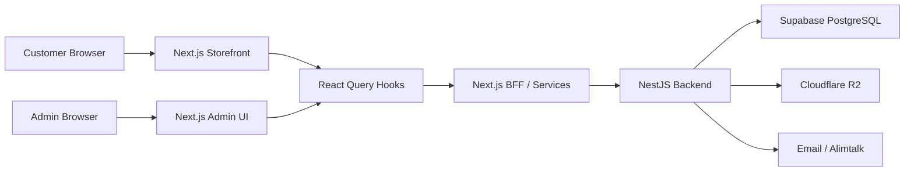

# LUCENT System Architecture

## Summary
LUCENT는 Next.js frontend와 NestJS backend를 중심으로 한 커머스 v2 전환 프로젝트입니다. 기존 운영 테이블을 즉시 교체하지 않고 `public.v2_*` 모델을 병행 구축해 상품, 가격, 장바구니, 주문, 이행, 디지털 권한을 단계적으로 분리했습니다.

## Scope
- Implementation scope: Frontend + Backend + DB
- Backend type: NestJS, 일부 Next.js BFF
- Database: Supabase PostgreSQL
- Deployment: backend CI/CD 확인, 공개 배포 확인 필요

## Architecture Diagram

## Frontend
- Framework: Next.js, React, TypeScript
- UI Scope: v2 상점 목록/상세, 장바구니, 체크아웃, 주문 완료, 마이페이지, 디지털 상품, 카탈로그 관리자, 캠페인/가격 관리자, 제작/배송 관리
- State/Data: React Query로 server state, mutation, invalidate 관리
- Architecture Point: 사용자 구매 화면과 관리자/운영 화면을 분리

## Backend/API
- Type: NestJS Controller/Service 기반 API
- BFF: 일부 Next.js API/BFF 경로 사용
- Main APIs: v2 shop, catalog admin, checkout, admin, fulfillment, products, projects, artists, auth, profiles, cart, orders, images, logs, notifications
- Responsibilities: 카탈로그, variant, bundle, campaign, pricing, cart, checkout, order snapshot, fulfillment, entitlement 처리

## Database
- Database: Supabase PostgreSQL
- Main Data: v2_projects, v2_products, v2_product_variants, bundle, campaign, price list, promotion, coupon, cart, order, fulfillment, media, audit 관련 테이블
- Design Point: 기존 운영 테이블과 v2 커머스 모델을 병행해 점진 전환 가능하게 구성
- Migration: v2 catalog, pricing, checkout/order, fulfillment, admin ops, cutover 관련 migration

## Storage & External Services
- Cloudflare R2: 이미지와 파일 저장
- SMTP/Email: 인증, 안내, 운영 메일
- Alimtalk: 알림톡 발송 연동

## Deployment
- Backend CI/CD workflow 확인
- 공개 배포 플랫폼과 운영 도메인은 확인 필요
- 포트폴리오 표기: `Next.js frontend + NestJS backend + Supabase/R2 기반`

## Key Flows
- Catalog: Admin form -> React Query mutation -> NestJS catalog API -> Supabase v2 tables
- Checkout: Cart UI -> checkout validate -> order create -> order snapshot 저장
- Fulfillment: Admin queue -> production/shipping/digital action -> fulfillment 상태 변경

## Portfolio Notes
- 강조할 점: 운영 중인 v1 구조를 유지하면서 v2 커머스 모델을 병행 구축
- 구현 범위 문구: `Frontend + Backend + DB`
- 비공개 처리: 고객 주문 데이터, 운영 테이블 원본, 스토리지/알림 키
