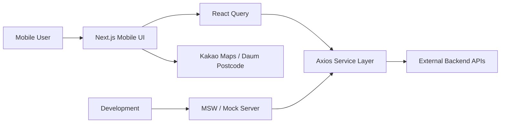

# SSUDAM System Architecture

## Summary
SSUDAM은 해커톤용 프론트엔드 중심 프로젝트입니다. Next.js 모바일 UI가 외부 인증/상담/지원정보 API와 연결되고, 개발 중에는 MSW와 mock server로 API 응답을 대체합니다. 직접 구현한 백엔드와 DB는 확인되지 않으므로 포트폴리오에서는 Frontend only로 표기합니다.

## Scope
- Implementation scope: Frontend only
- Backend type: 외부 API 연동, MSW mock
- Database: 직접 구현 없음
- Deployment: 확인 필요

## Architecture Diagram

## Frontend
- Framework: Next.js, React, TypeScript
- UI Scope: 홈, AI 상담 온보딩, 상담 채팅, 지원사업 목록/상세, 스크랩, 주변 시설 지도, 자가진단, 로그인/회원가입
- State/Data: React Query로 API 조회/mutation, Context로 모달/토스트/사이드바/주소 검색 상태 관리
- Architecture Point: atom/molecule/organism/template 구조와 Storybook stories 구성

## Backend/API
- 직접 구현한 백엔드는 없음
- External API: 인증, 상담, 지원정보, 스크랩, 사용자 API 연동
- Mocking: MSW handler와 Express 기반 mock server로 개발 중 응답 대체
- Portfolio Note: API 연동은 기여로 표기하되, 백엔드 구현으로 표현하지 않음

## Database
- 직접 설계하거나 구현한 DB 없음
- 포트폴리오에서는 Database section을 숨기거나 `직접 구현 없음`으로 표기

## Storage & External Services
- Kakao Maps SDK: 주변 시설 지도와 마커 표시
- Daum Postcode: 주소 검색
- MSW: 개발 중 mock response
- Storybook/Chromatic: 컴포넌트 검증 전제

## Deployment
- 실제 배포 플랫폼과 운영 도메인은 확인 필요
- 포트폴리오 표기: `Next.js frontend + external API integration`

## Key Flows
- Counseling: 온보딩 -> 채팅 입력 -> React Query mutation -> 외부 상담 API -> messageType별 UI 분기
- Support Info: 목록 화면 -> API 조회 -> 카드 데이터 변환 -> 상세 화면 이동
- Map: 지도 화면 -> Kakao Maps loader -> 키워드 검색 -> 마커 표시

## Portfolio Notes
- 강조할 점: Frontend only, 외부 API 연동, MSW 목업, 모바일 UI 구조
- 구현 범위 문구: `Frontend only`
- 비공개 처리: 외부 API 서버 주소, 토큰, 실제 상담/사용자 데이터
