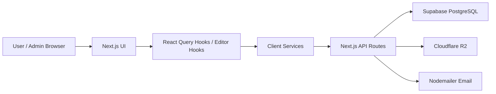

# TEMIS System Architecture

## Summary
TEMIS는 Next.js App Router 안에서 화면과 API Route를 함께 구성한 풀스택형 프로젝트입니다. 프론트엔드는 제작 도구, 템플릿 상점, 주문/관리 화면을 담당하고, Next.js API Route는 Supabase, Cloudflare R2, 이메일 발송을 감싸는 서버 계층으로 동작합니다.

## Scope
- Implementation scope: Frontend + Backend + DB
- Backend type: Next.js API Route 기반 BFF/서버 기능
- Database: Supabase PostgreSQL
- Deployment: 확인 필요

## Architecture Diagram

## Frontend
- Framework: Next.js App Router, React, TypeScript
- UI Scope: 랜딩, 인증, 일정표 편집기, 팀 일정표, 썸네일 템플릿, 템플릿 상점, 커스텀 주문, 마이페이지, 관리자 대시보드
- State/Data: React Query로 서버 상태 관리, Context/custom hook으로 편집기 UI 상태 관리
- Architecture Point: 템플릿마다 달라지는 입력 구조를 설정 기반 hook으로 주입해 편집기 로직을 재사용

## Backend/API
- Type: Next.js API Route 기반 BFF/서버 기능
- Main APIs: 인증, 사용자/관리자, 템플릿, 상점, 구매 요청, 커스텀 주문, 파일 업로드, 이메일, 정산 보조 API
- Responsibilities: 권한 확인, DB 조회/변경, 파일 업로드 검증, 이메일 토큰 발송, 관리자 작업 처리
- Notes: 별도 Nest/Express 서버가 아니라 Next.js 서버 기능으로 백엔드 역할을 수행

## Database
- Database: Supabase PostgreSQL
- Main Data: 사용자, 템플릿, 팀, 구매 요청, 포트폴리오, 렌더 설정, 작가/판매 통계, 정산/로열티 관련 데이터
- Design Point: 사용자-템플릿 접근 권한, 작가-템플릿 판매, 팀-멤버-일정표 관계를 분리
- Migration: Supabase migration으로 운영 데이터 구조를 단계적으로 추가

## Storage & External Services
- Cloudflare R2: 주문 파일, 포트폴리오 이미지, 다운로드 파일 저장
- Nodemailer: 이메일 인증, 초대, 비밀번호 재설정
- Image/Screenshot tooling: 화면 결과물 이미지 저장 및 다운로드

## Deployment
- 실제 배포 플랫폼과 운영 도메인은 확인 필요
- 포트폴리오 표기: `Next.js + Supabase + Cloudflare R2 기반 구조`

## Key Flows
- Template Editing: UI 입력 -> editor hook -> preview/render -> 저장 API -> Supabase
- Purchase Request: 상점 화면 -> React Query mutation -> API Route -> 구매 요청/권한 데이터 저장
- File Upload: 업로드 요청 -> API Route 검증 -> R2 저장 -> Supabase record 연결

## Portfolio Notes
- 강조할 점: 제작 도구, 커머스, 관리자 운영을 한 서비스 흐름으로 연결
- 구현 범위 문구: `Frontend + Backend + DB`, 단 Backend는 `Next.js API Route 기반`
- 비공개 처리: 사용자 정보, 작가/고객 데이터, 운영 DB, 이메일/스토리지 키
