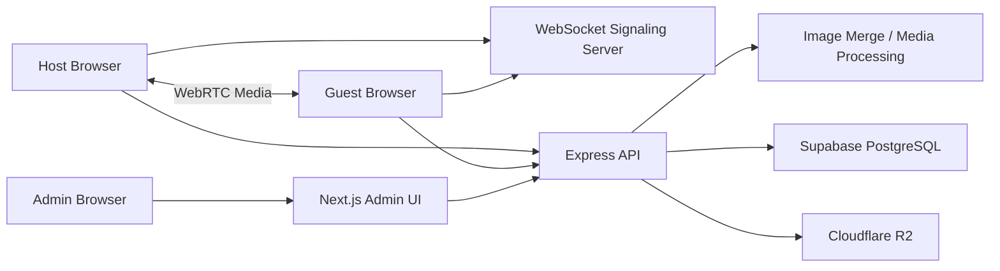

# VSHOT System Architecture

## Summary
VSHOT은 Next.js 클라이언트와 Node.js/Express 서버가 분리된 실시간 미디어 프로젝트입니다. WebRTC는 Host와 Guest의 실시간 미리보기에 사용하고, WebSocket 서버는 signaling과 room/session 제어를 담당합니다. 최종 사진은 각 클라이언트의 원본 캡처를 서버로 업로드해 합성하는 구조입니다.

## Scope
- Implementation scope: Frontend + Backend + DB
- Backend type: Node.js, Express, WebSocket
- Database: Supabase PostgreSQL
- Deployment: client/server 분리 배포 전제, 세부 확인 필요

## Architecture Diagram

## Frontend
- Framework: Next.js, React, TypeScript
- UI Scope: Host 준비/촬영 룸, Guest 준비/촬영 룸, Festa 모드, 다운로드 페이지, 관리자 대시보드, 프레임/유저/그룹 관리
- State/Data: Zustand와 custom hook으로 촬영 세션, media device, WebRTC 연결, chroma key, capture flow 분리
- Architecture Point: Host는 촬영 제어, Guest는 입장/촬영/선택/다운로드 흐름에 집중하도록 역할별 화면 분리

## Backend/API
- Type: Node.js, Express, WebSocket
- Main APIs: signaling, ICE config, photo upload/merge, frame CRUD, frame access, group/user management, auth, internal status
- Responsibilities: room 생성/참여/재입장, signaling relay, upload coordination, server-side image merge, 권한/관리자 기능
- Realtime Point: WebSocket signaling과 WebRTC media channel을 분리

## Database
- Database: Supabase PostgreSQL
- Main Data: files, films, frames, groups, user_groups, frame_access, users
- Design Point: 촬영 결과 file/film record와 프레임 접근 권한을 분리
- Migration: 파일, 필름, 프레임, 그룹, 접근 권한 구조를 단계적으로 추가

## Storage & External Services
- Cloudflare R2: 촬영 결과물과 프레임 파일 저장
- TURN/STUN: WebRTC 연결 보조
- WebGL/Sharp/FFmpeg: 클라이언트/서버 미디어 합성 및 처리

## Deployment
- Client와 server를 분리 배포하는 구조
- server GitHub Actions workflow 존재
- 실제 운영 도메인, 서버 플랫폼, TURN/STUN 운영 정보는 확인 필요

## Key Flows
- Realtime Room: Host 방 생성 -> Guest 입장 -> WebSocket signaling -> WebRTC 연결
- Capture: 촬영 트리거 -> 각 클라이언트 원본 캡처 -> 서버 업로드 -> merge -> R2 저장
- Admin: 관리자 화면 -> API -> 프레임/그룹/권한 DB 변경

## Portfolio Notes
- 강조할 점: WebRTC preview와 고해상도 원본 캡처/서버 합성을 분리한 구조
- 구현 범위 문구: `Frontend + Backend + DB`, 실시간 미디어 처리 포함
- 비공개 처리: 이벤트 운영 데이터, 서버 키, 스토리지 키, TURN/STUN 인증 정보
